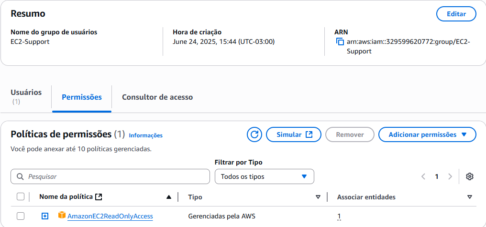
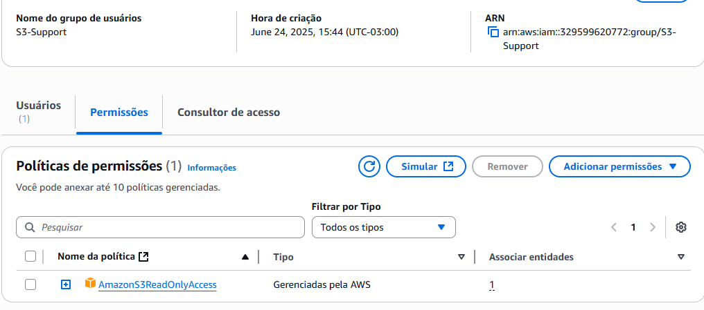
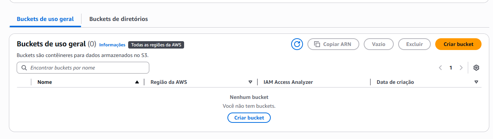
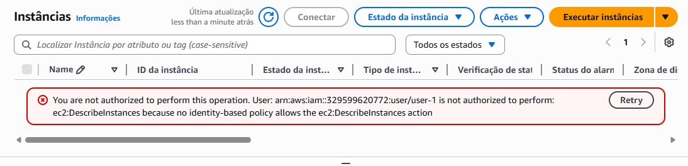
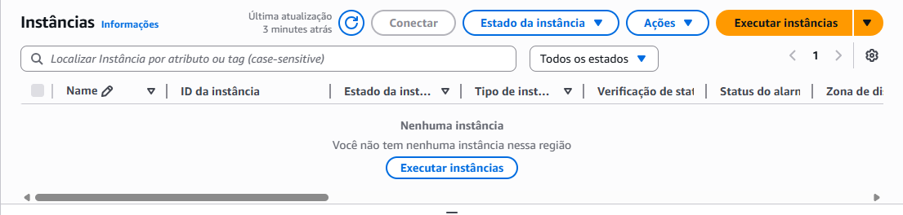
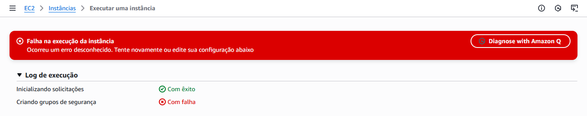
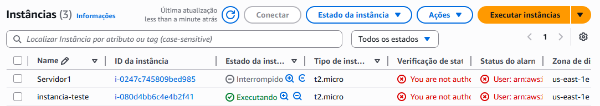
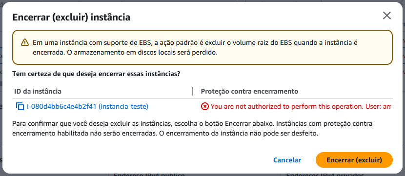

# Gerenciando Permissões no IAM AWS

Este projeto demonstra como gerenciar permissões de usuários no AWS IAM por meio da criação de **grupos com políticas específicas** e associação de usuários a esses grupos. O foco é em permissões relacionadas ao Amazon EC2 e Amazon S3.

## 📌 Cenário

Três usuários foram criados e atribuídos a diferentes grupos com permissões distintas:

| Usuário  | Grupo        | Permissões                                                                 |
|----------|--------------|----------------------------------------------------------------------------|
| user-1   | S3-Support   | Leitura (ReadOnly) ao Amazon S3                                           |
| user-2   | EC2-Support  | Leitura (ReadOnly) ao Amazon EC2                                          |
| user-3   | EC2-Admin    | Visualizar, iniciar e parar instâncias EC2 (permissões personalizadas)    |

---

## 👥 Grupos IAM e Políticas

### 🔹 Grupo EC2-Admin
- **Política personalizada inline** que permite visualizar, iniciar e parar instâncias EC2.

---

### 🔹 Grupo EC2-Support
- **Política gerenciada pela AWS**: `AmazonEC2ReadOnlyAccess`

---

### 🔹 Grupo S3-Support
- **Política gerenciada pela AWS**: `AmazonS3ReadOnlyAccess`

---

## 🔐 Testes de Acesso

### ✅ user-1 acessando o S3 (permitido)
Visualização de buckets no console do Amazon S3.

---

### ❌ user-1 tentando acessar EC2 (negado)
Mensagem de erro por falta de permissão para `ec2:DescribeInstances`.

---

### ✅ user-2 acessando EC2 (somente leitura)
Consegue visualizar as instâncias.

---

### ❌ user-2 tentando criar instância EC2 (negado)
Erro ao tentar executar instância devido à permissão limitada de leitura.

---

### ✅ user-3 criando instância EC2 (permitido)
Usuário com permissão para iniciar instâncias EC2.

---

### ❌ user-3 tentando encerrar instância EC2 (negado)
Permissão de encerramento não incluída na política personalizada.

---

## ✅ Conclusão

Este projeto mostrou na prática como o **IAM** da AWS permite um controle granular sobre o que cada usuário pode ou não fazer dentro da conta AWS. Utilizar grupos com políticas bem definidas melhora a **gestão de permissões** e a **segurança** dos recursos.

---

## ✍️ Autor

**Murilo Carnelós**  
🔗 [LinkedIn](https://linkedin.com/in/murilo-carnelos)

---
